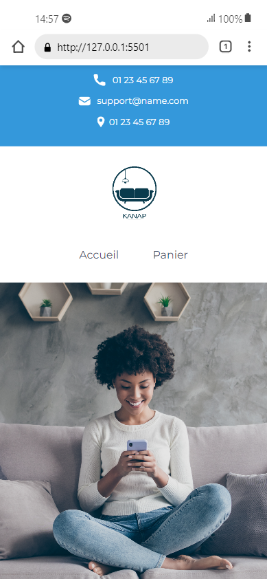

# Kanap #

This is the front end and back end server for Project 5 of the Web Developer path.

### Conditions préalables au back-end ###

Vous aurez besoin d’avoir Node et installé localement sur votre machine.`npm`

### Installation en arrière-plan ###

Clonez ce dépôt. Dans le dossier « back » du projet, exécutez . Vous pouvez ensuite exécuter le serveur avec `npm install` `node server` 

Le serveur doit fonctionner avec le port par défaut. Si le serveur s’exécute sur un autre port pour une raison quelconque, celui-ci est affiché sur la console au démarrage du serveur, par exemple `localhost``3000` `Listening on port 3001`

> **Skills assesed in this project**

-   [x] Créer un **plan de test** pour une application
-   [x] Gérer **les événements JavaScript**
-   [x] Interagir avec **un service web (API)** avec JavaScript
-   [x] **Valider les données** provenant de sources externes

